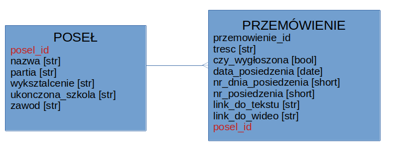

# sejm-scraper
Służy do scrapowania wypowiedzi sejmowych

## Plan działań
1. Opracowanie modelu bazy danych [zrobione i wygląda jak poniżej]

2. Ogarnięcie strony sejmowej i pierwsze próby scrapowania
3. Zapis do lokalnej bazy danych SQLite
4. Wykonanie ciekawych zapytań, np. ile razy we wszystkich wypowiedziach posła padło słowo _hańba_?
